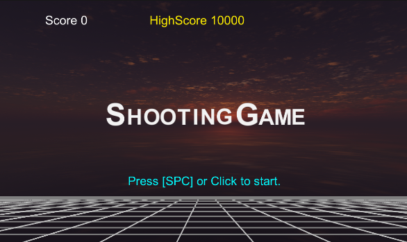
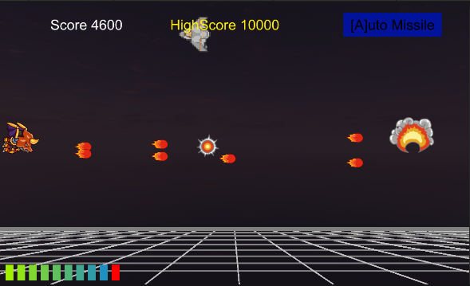
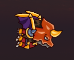
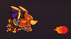
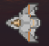
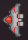
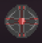
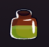
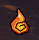

[7大ゲームの作り方を完全マスター！　ゲームアルゴリズムまるごと図鑑](https://direct.gihyo.jp/view/item/000000002620?category_page_id=all_items)を参考にしてUnityで作成したシューティングゲーム

アイテムを取得して自機の強化やエネルギーを回復しながら高得点を目指す

一定時間経過でステージクリアとなり無限にループする

プレイは[こちら](https://budgerigar543875.github.io/ShootingGame/)

### 自機
<table>
    <tr>
        <td></td>
        <td>スペースキー押下で弾を発射 Aキー押下でオート連射（再度Aキー押下で解除） 矢印キーで移動</td>
    </tr>
    <tr>
        <td></td>
        <td>通常弾</td>
    </tr>
    <tr>
        <td></td>
        <td>貫通弾</td>
    </tr>
</table>

### 敵機
<table>
    <tr>
        <td></td>
        <td>1発当てると撃破可能 ステージが進むと耐久力UP</td>
    </tr>
    <tr>
        <td></td>
        <td>2発当てると撃破可能 ステージが進むと耐久力UP</td>
    </tr>
    <tr>
        <td></td>
        <td>3発当てると撃破可能 ステージが進むと耐久力UP</td>
    </tr>
    <tr>
        <td></td>
        <td>撃破不能な敵 自機で体当たりすると撃破可能</td>
    </tr>
</table>

### アイテム
<table>
    <tr>
        <td></td>
        <td>エネルギーを1つ回復する</td>
    </tr>
    <tr>
        <td></td>
        <td>同時発射弾数が増える 同時発射の最大は9発</td>
    </tr>
    <tr>
        <td></td>
        <td>100発分貫通弾を発射できる 残弾有りで取得した場合は現在の残弾に+100</td>
    </tr>
</table>